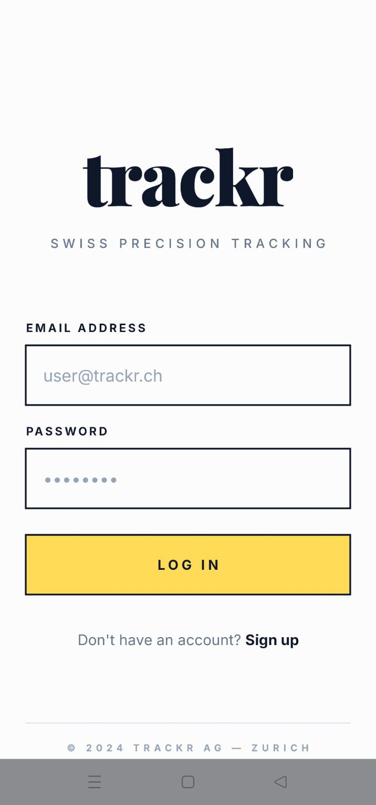
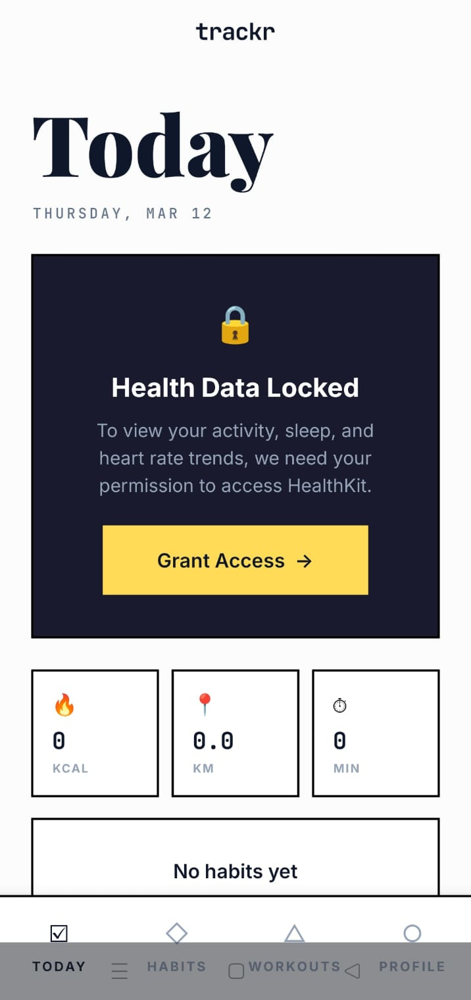
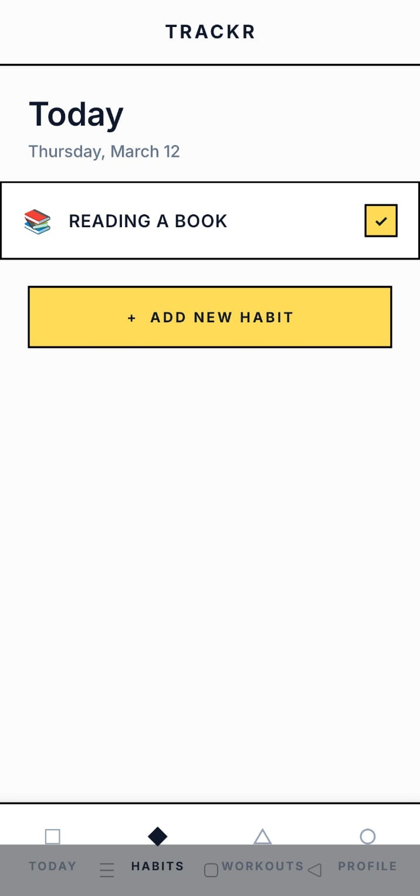
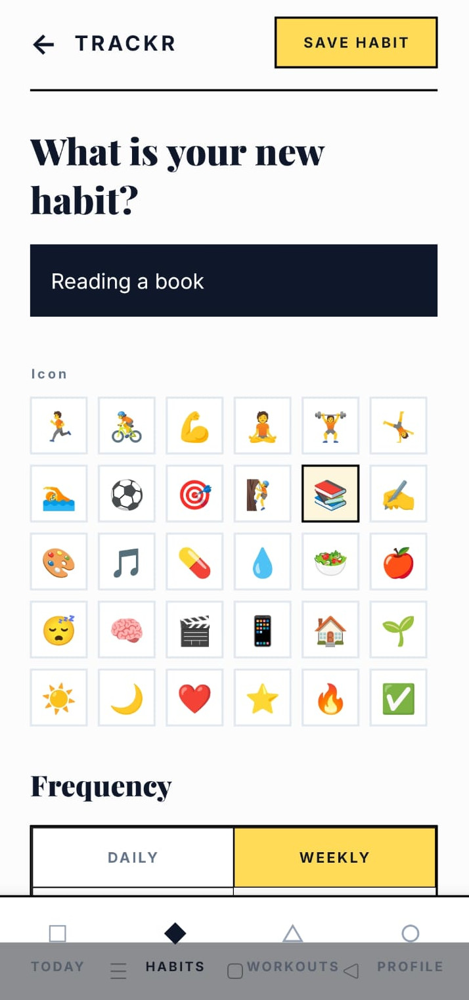
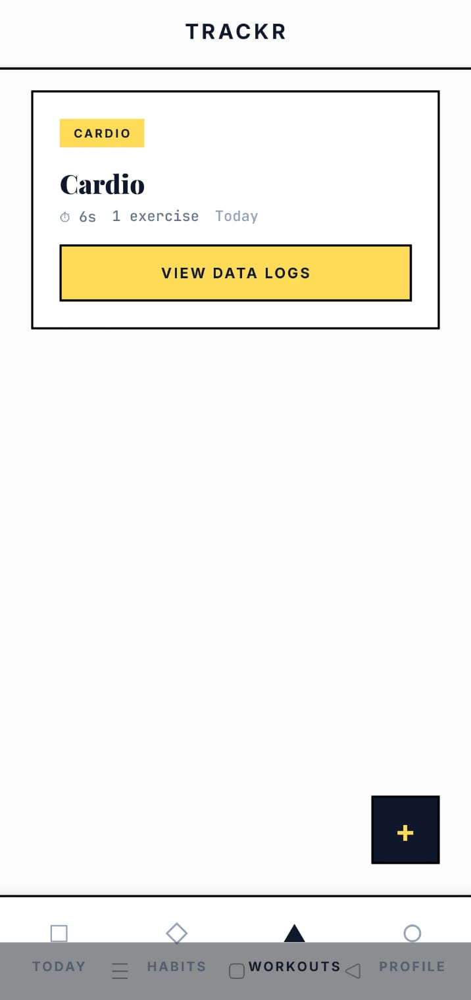
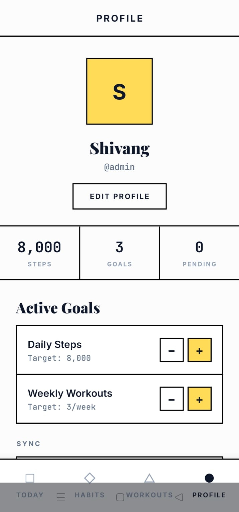

<p align="center">
  
</p>

<h1 align="center">trackr</h1>
<p align="center"><strong>Swiss precision tracking for fitness and habits</strong></p>
<p align="center">
  React Native &middot; Offline-first &middot; Native health APIs &middot; Version vector sync
</p>

<br />

A cross-platform fitness and habit tracker with two things going on under the hood that most apps skip: a **custom native health data bridge** (Swift + Kotlin, no third-party wrappers) and an **offline-first sync engine** built on version vectors instead of timestamps.

The design language is inspired by Swiss typographic style — Playfair Display for headlines, JetBrains Mono for data, Inter for body text, and a strict black-border system with mustard-yellow accents throughout.

---

## The App

### Today

Your daily command center. Steps, calories, distance, and active minutes pulled directly from HealthKit or Health Connect through the native bridge. Below the health stats, today's habits are listed for quick one-tap completion.

<p align="center">
  
</p>

The health data panel requests permissions inline — no separate settings screen. If permissions are denied, the rest of the dashboard still works. Health metrics are displayed in monospaced type using the card grid layout.

---

### Habits

Create habits with custom icons, colors, and daily or weekly frequency. Each habit shows as a bordered card with a checkbox toggle. Haptic feedback fires on completion.

<p align="center">
  
  &nbsp;&nbsp;&nbsp;&nbsp;
  
</p>

The form lets you pick from 30 emoji icons, set frequency, and choose a color. Habits are stored in Realm first, synced to the server in the background — you'll never notice the network.

---

### Workouts

Log workouts with full exercise-level detail. Each workout tracks type (strength, cardio, flexibility), duration via a live timer, and individual sets with weight and reps. Workout cards show a type badge, duration, and exercise count at a glance.

<p align="center">
  
</p>

Imported workouts from HealthKit/Health Connect appear alongside manual entries. The active workout screen supports both strength logging (sets × reps × weight) and cardio logging (distance, pace).

---

### Profile & Goals

Your profile shows daily step targets, weekly workout goals, and sync status. Goals are adjustable with increment/decrement controls. The sync panel gives visibility into what's been pushed, what's pending, and the last sync timestamp.

<p align="center">
  
</p>

---

## The Two Hard Problems

### 1. Native Health Bridge

React Native libraries for HealthKit and Health Connect exist — but wrapping one proves nothing about native development. trackr implements custom Swift and Kotlin modules that talk directly to the platform health APIs, unified behind a single TypeScript interface.

```
HealthBridge.requestPermissions()
HealthBridge.getDailySteps(date)
HealthBridge.getActivitySummary(date)
HealthBridge.getWorkouts(startDate, endDate)
HealthBridge.subscribeToSteps(callback)
```

Five methods, one subscription. That's the entire native surface area. Components import `HealthBridge` and never know which OS they're running on.

The native bridge code lives in `modules/health-bridge/` — Swift for iOS, Kotlin for Android.

### 2. Offline-First Sync Engine

Fitness apps that break without wifi are useless. trackr writes everything to Realm first, syncs to the server eventually, and uses version vectors (not timestamps) to detect and resolve conflicts across devices.

Version vectors encode causal ordering — they tell you whether two edits are sequential or concurrent, without relying on device clocks. When conflicts happen, resolution rules depend on data type:

| Data type | Strategy |
|-----------|----------|
| Health readings | Trust the device sensor |
| Habit completions | Preserve both sides |
| Profile edits | Last-write-wins |
| Workouts | Device-of-origin wins |

The sync engine implementation is in `src/sync/engine.ts`.

---

## Architecture

```
┌─────────────────────────────────────┐
│          React Native UI            │
│   Today · Habits · Workouts · Profile
└──────────────┬──────────────────────┘
               │
        ┌──────┴──────┐
        │ HealthBridge │  ← Swift (HealthKit) / Kotlin (Health Connect) / Mock
        └──────┬──────┘
               │
        ┌──────┴──────┐
        │    Realm     │  ← All reads/writes go here first
        └──────┬──────┘
               │
        ┌──────┴──────┐
        │ Sync Engine  │  ← Version vectors, conflict resolution, background sync
        └──────┬──────┘
               │
        ┌──────┴──────┐
        │ Express API  │  ← MongoDB, JWT auth
        └─────────────┘
```

Key entry points:
- `modules/health-bridge/` — native Swift + Kotlin health modules
- `src/sync/engine.ts` — version vector sync engine
- `server/src/routes/` — Express API endpoints
- `src/db/` — Realm schemas and write helpers

---

## Tech Stack

| Layer | Tech |
|-------|------|
| Mobile | React Native 0.83 + Expo 55 (managed + config plugins) |
| iOS native | Swift — HealthKit via Expo Modules API |
| Android native | Kotlin — Health Connect via Expo Modules API |
| Local DB | Realm 20 |
| Navigation | React Navigation 7 (bottom tabs + native stack) |
| Typography | Playfair Display, JetBrains Mono, Inter |
| Server | Express.js + TypeScript |
| Database | MongoDB 7 + Mongoose |
| Auth | JWT (access + refresh tokens), bcrypt |
| Validation | Zod |
| Container | Docker Compose (MongoDB) |

---

## Quick Start

```bash
git clone https://github.com/VanshDevChoudhary/Trackr.git
cd Trackr

# mobile
cp .env.example .env
npm install

# server (needs MongoDB)
docker compose up -d
cd server && npm install && npm run dev

# back to root
cd ..
npx expo start
```

For native health features (HealthKit / Health Connect), you need a dev build:

```bash
npx expo prebuild
npx expo run:ios    # or run:android
```

Expo Go works for everything except health data — falls back to a mock provider automatically.

---

## Known Issues / Roadmap

**Known issues:**
- Health Connect on Android requires the Health Connect app installed separately on some emulator images
- Step subscription on Android polls every 30s vs near-instant on iOS (no push API in Health Connect)
- Workout calorie import from Android returns 0 — needs a separate `TotalCaloriesBurnedRecord` query
- Background fetch timing is OS-controlled and unreliable on both platforms

**Roadmap (no promises):**
- [ ] Configurable units (kg/lbs) in workout logging
- [ ] WebSocket sync for multi-device real-time
- [ ] Manual conflict resolution UI
- [ ] Push notifications for habit reminders
- [ ] CSV/JSON data export

---

## License

[MIT](LICENSE)
